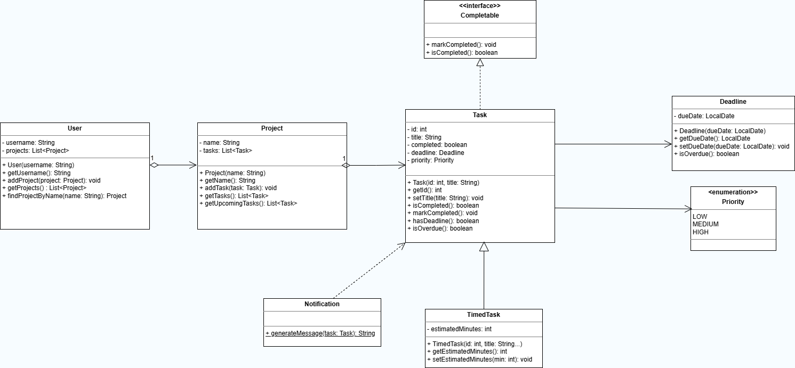
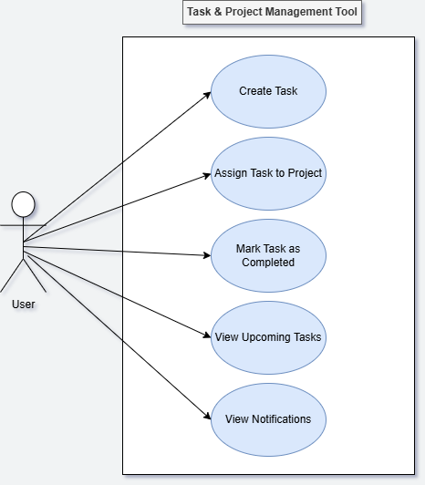

# System Design

## UML Class Diagram
The following diagram shows the class structure of the Task & Project Management Tool, including inheritance, interfaces, and relationships between classes.

## UML Use Case Diagram
The following diagram illustrates how the user interacts with the system through the console-based interface.

